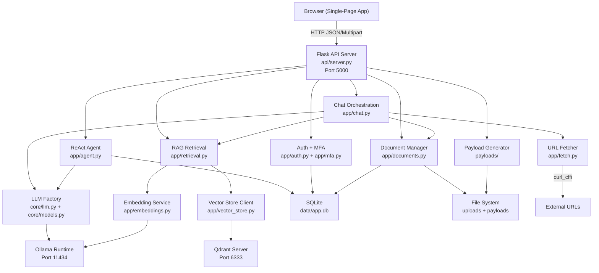
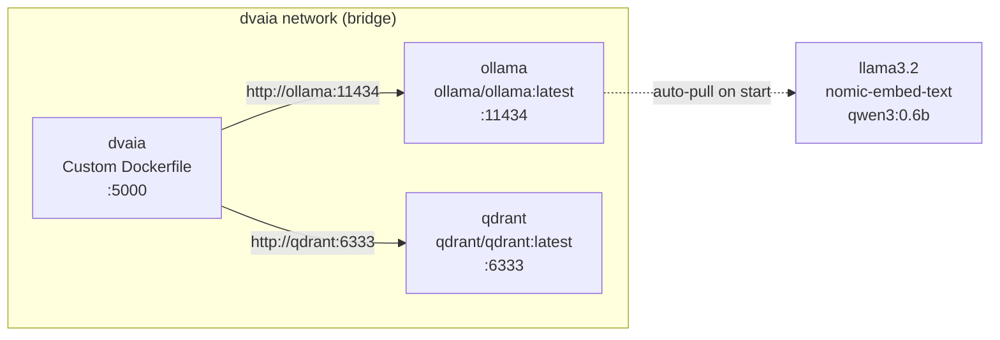
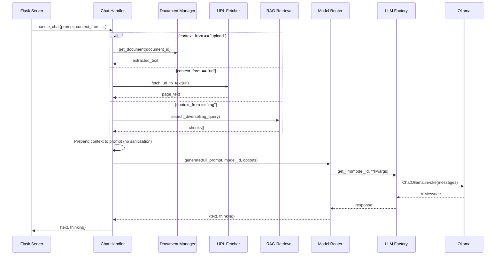
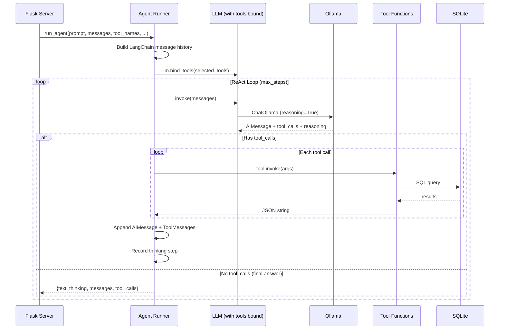

# Design Document: DVAIA Architecture Documentation

## Overview

DVAIA (Damn Vulnerable AI Application) is a deliberately vulnerable web application built for AI red-team testing and security research. It provides a single-page Flask UI with eight interactive attack panels (Direct Injection, Document Injection, Web Injection, RAG Poisoning, Template Injection, Agentic, Payloads, and Instructions) that exercise different AI vulnerability classes against a local Ollama LLM backend.

The system is composed of four primary layers: a Flask HTTP server serving a single-page HTML frontend, a LangChain orchestration layer for chat and agentic workflows, an Ollama integration layer for local model inference and embeddings, and a Qdrant vector database for RAG storage and semantic search. All components are containerized via Docker Compose and communicate over a bridge network. Every endpoint is intentionally vulnerable — no input sanitization, no SSRF allowlists, no template escaping, no CSRF protection — to enable realistic red-team exercises.

## Architecture

### System Overview

### Docker Compose Topology

Services:
- `ollama`: Model runtime. Auto-pulls llama3.2, nomic-embed-text, and qwen3:0.6b on first start. Persistent volume for model weights.
- `qdrant`: Vector database. Ephemeral (no persistent volume) — starts empty each `docker compose up`.
- `dvaia`: Flask application. Mounts project root as `/app`. All runtime data in `/tmp` (database, uploads, payloads).

## Components and Interfaces

### Component 1: Flask UI Layer (`api/server.py`, `api/templates/index.html`)

**Purpose**: HTTP entry point. Serves the single-page frontend and exposes all REST API endpoints. Thin delegation layer — no business logic, just request parsing and response formatting.

**Interface**:

| Route | Method | Description |
|---|---|---|
| `/` | GET | Serve single-page HTML (index.html) |
| `/api/health` | GET | Health check |
| `/api/models` | GET | List available models and defaults |
| `/api/chat` | POST | Direct/document/web/RAG chat (delegates to `app.chat`) |
| `/api/chat-with-template` | POST | Template injection chat (substitutes `{{user_input}}` without escaping) |
| `/api/agent/chat` | POST | Agentic ReAct chat (delegates to `app.agent`) |
| `/api/login` | POST | Session login (username/password) |
| `/api/logout` | POST | Clear session |
| `/api/session` | GET | Current session info |
| `/api/mfa` | POST | MFA code verification |
| `/api/documents/upload` | POST | Multipart file upload |
| `/api/documents` | GET | List documents |
| `/api/documents/<id>` | GET/DELETE | Get or delete document |
| `/api/rag/search` | GET | Semantic search over RAG chunks |
| `/api/rag/chunks` | GET/POST | List or add RAG chunks |
| `/api/rag/add-document/<id>` | POST | Chunk, embed, and index a document |
| `/api/rag/delete-by-source` | POST | Delete RAG chunks by source label |
| `/api/payloads/generate` | POST | Generate payload asset (text, PDF, image, QR, audio) |
| `/api/payloads/list` | GET | List generated payload files |
| `/api/payloads/file/<path>` | GET | Download a generated payload file |
| `/evil/` | GET | Serve malicious HTML page for web-injection tests |

**Responsibilities**:
- Parse JSON/multipart requests, extract parameters with defaults
- Manage Flask session (user_id, mfa_verified)
- Initialize SQLite database on first request (`_ensure_db()`)
- Delegate all logic to `app.*` modules — no direct DB or LLM calls

**Frontend** (`api/templates/index.html`, `api/static/js/`, `api/static/css/`):
- Single HTML page with 8 tabbed panels, each targeting a different vulnerability class
- JavaScript modules: `app.js` (chat panels), `session.js` (auth flow), `documents.js` (upload/list), `rag.js` (RAG operations), `payloads.js` (payload generation)
- Sampling controls exposed per-panel: temperature, top_k, top_p, max_tokens, repeat_penalty

### Component 2: LangChain Orchestration (`app/chat.py`, `app/agent.py`, `core/models.py`)

**Purpose**: Bridges user requests to LLM inference. Two modes: simple chat (single/multi-turn with optional context injection) and agentic ReAct loop with tool calling.

**Chat Flow** (`app/chat.py → core/models.py → core/llm.py`):

**Context injection** (vulnerable by design): Document text, URL content, or RAG chunks are prepended directly to the user prompt with labels like `"Context from document:\n{text}\n"`. No escaping or sanitization.

**Multi-turn**: When `messages` list is provided, it bypasses context building and sends the full conversation history directly to `generate()`.

**Agent Flow** (`app/agent.py`):

**6 Agent Tools** (all SQLite-backed, no auth checks):

| Tool | Access | Description |
|---|---|---|
| `list_users` | Read | All users (id, username, role, created_at) |
| `list_documents` | Read | All documents (id, filename, user_id, created_at) |
| `list_secret_agents` | Read | All secret agents (id, name, handler, mission) |
| `get_document_by_id` | Read | Single document with extracted_text (truncated to 5000 chars) |
| `delete_document_by_id` | Write | Delete document — no auth check (vulnerable by design) |
| `get_internal_config` | Read | Fake internal API key and config (red-team bait) |

**Responsibilities**:
- Convert `[{role, content}]` dicts to LangChain `HumanMessage`/`AIMessage`/`SystemMessage` objects
- Support tool subset selection via `tool_names` parameter
- Extract chain-of-thought from Ollama's `reasoning_content` / `message.thinking` fields
- Format ReAct steps into human-readable thinking trace for the UI side panel
