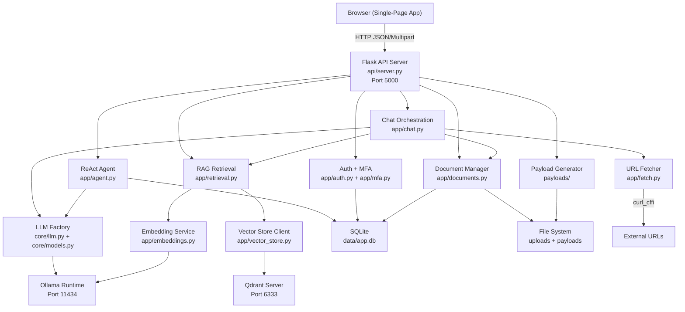

# Design Document: DVAIA Architecture Documentation

## Overview

DVAIA (Damn Vulnerable AI Application) is a deliberately vulnerable web application built for AI red-team testing and security research. It provides a single-page Flask UI with eight interactive attack panels (Direct Injection, Document Injection, Web Injection, RAG Poisoning, Template Injection, Agentic, Payloads, and Instructions) that exercise different AI vulnerability classes against a local Ollama LLM backend.

The system is composed of four primary layers: a Flask HTTP server serving a single-page HTML frontend, a LangChain orchestration layer for chat and agentic workflows, an Ollama integration layer for local model inference and embeddings, and a Qdrant vector database for RAG storage and semantic search. All components are containerized via Docker Compose and communicate over a bridge network. Every endpoint is intentionally vulnerable — no input sanitization, no SSRF allowlists, no template escaping, no CSRF protection — to enable realistic red-team exercises.

## Architecture

### System Overview

