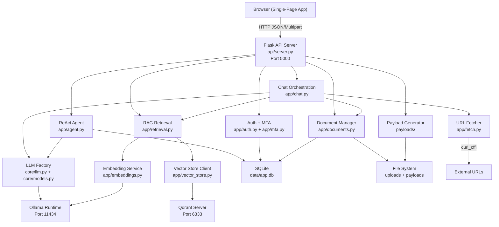
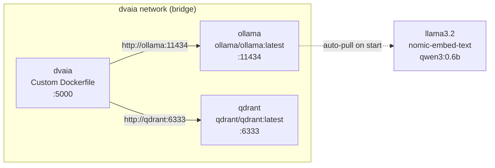
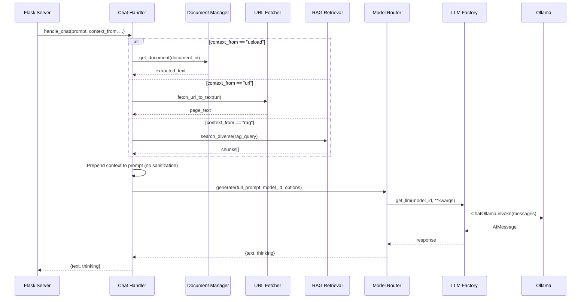
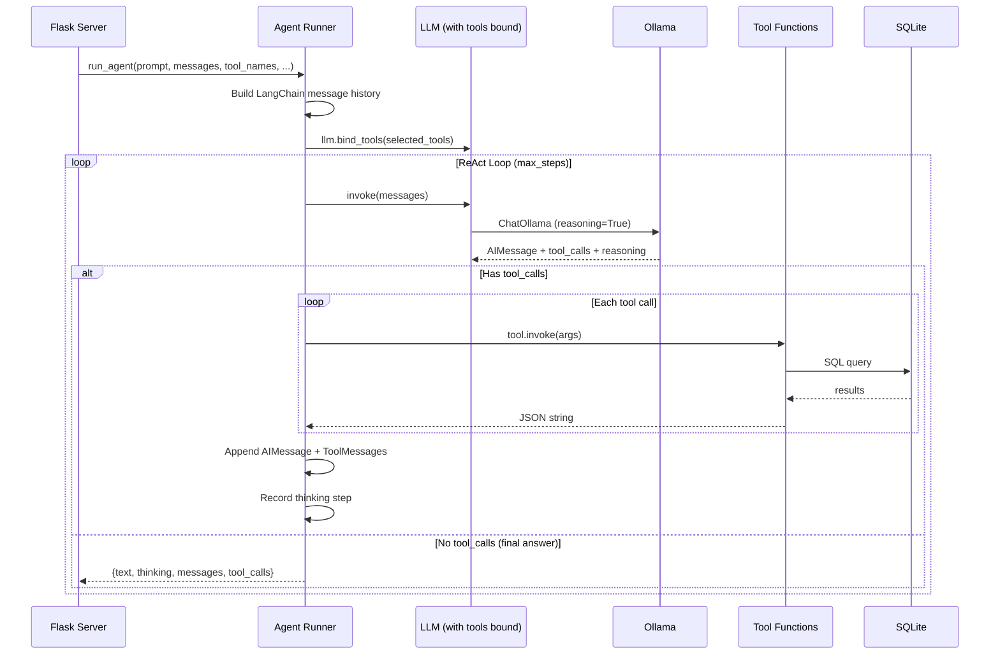
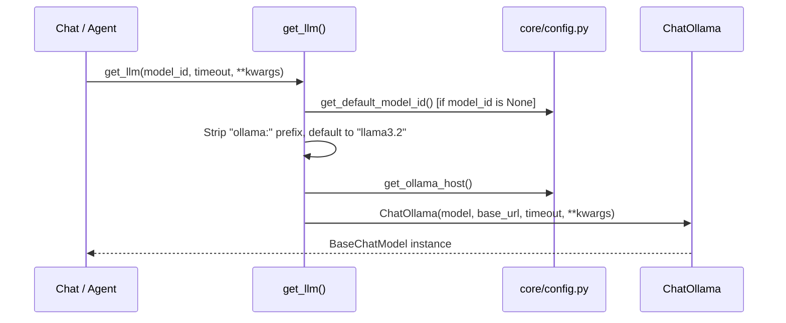
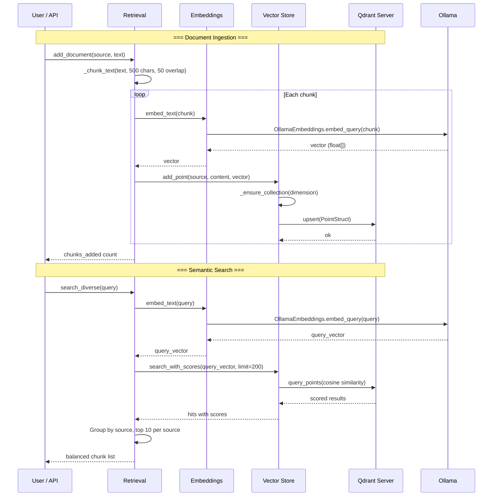
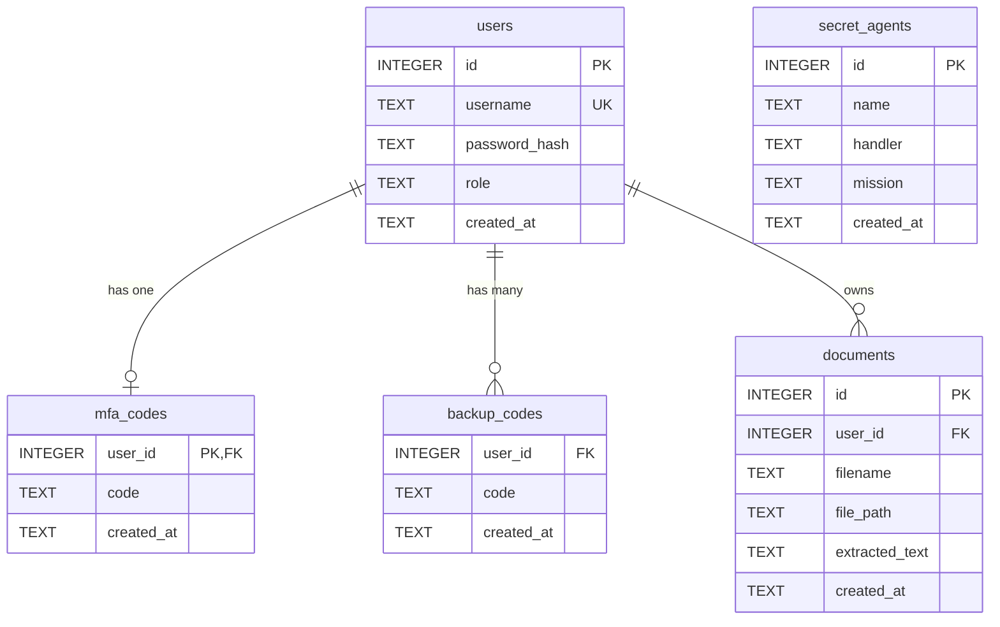

# Design Document: DVAIA Architecture Documentation

## Overview

DVAIA (Damn Vulnerable AI Application) is a deliberately vulnerable web application built for AI red-team testing and security research. It provides a single-page Flask UI with eight interactive attack panels (Direct Injection, Document Injection, Web Injection, RAG Poisoning, Template Injection, Agentic, Payloads, and Instructions) that exercise different AI vulnerability classes against a local Ollama LLM backend.

The system is composed of four primary layers: a Flask HTTP server serving a single-page HTML frontend, a LangChain orchestration layer for chat and agentic workflows, an Ollama integration layer for local model inference and embeddings, and a Qdrant vector database for RAG storage and semantic search. All components are containerized via Docker Compose and communicate over a bridge network. Every endpoint is intentionally vulnerable — no input sanitization, no SSRF allowlists, no template escaping, no CSRF protection — to enable realistic red-team exercises.

## Architecture

### System Overview

### Docker Compose Topology

Services:
- `ollama`: Model runtime. Auto-pulls llama3.2, nomic-embed-text, and qwen3:0.6b on first start. Persistent volume for model weights.
- `qdrant`: Vector database. Ephemeral (no persistent volume) — starts empty each `docker compose up`.
- `dvaia`: Flask application. Mounts project root as `/app`. All runtime data in `/tmp` (database, uploads, payloads).

## Components and Interfaces

### Component 1: Flask UI Layer (`api/server.py`, `api/templates/index.html`)

**Purpose**: HTTP entry point. Serves the single-page frontend and exposes all REST API endpoints. Thin delegation layer — no business logic, just request parsing and response formatting.

**Interface**:

| Route | Method | Description |
|---|---|---|
| `/` | GET | Serve single-page HTML (index.html) |
| `/api/health` | GET | Health check |
| `/api/models` | GET | List available models and defaults |
| `/api/chat` | POST | Direct/document/web/RAG chat (delegates to `app.chat`) |
| `/api/chat-with-template` | POST | Template injection chat (substitutes `{{user_input}}` without escaping) |
| `/api/agent/chat` | POST | Agentic ReAct chat (delegates to `app.agent`) |
| `/api/login` | POST | Session login (username/password) |
| `/api/logout` | POST | Clear session |
| `/api/session` | GET | Current session info |
| `/api/mfa` | POST | MFA code verification |
| `/api/documents/upload` | POST | Multipart file upload |
| `/api/documents` | GET | List documents |
| `/api/documents/<id>` | GET/DELETE | Get or delete document |
| `/api/rag/search` | GET | Semantic search over RAG chunks |
| `/api/rag/chunks` | GET/POST | List or add RAG chunks |
| `/api/rag/add-document/<id>` | POST | Chunk, embed, and index a document |
| `/api/rag/delete-by-source` | POST | Delete RAG chunks by source label |
| `/api/payloads/generate` | POST | Generate payload asset (text, PDF, image, QR, audio) |
| `/api/payloads/list` | GET | List generated payload files |
| `/api/payloads/file/<path>` | GET | Download a generated payload file |
| `/evil/` | GET | Serve malicious HTML page for web-injection tests |

**Responsibilities**:
- Parse JSON/multipart requests, extract parameters with defaults
- Manage Flask session (user_id, mfa_verified)
- Initialize SQLite database on first request (`_ensure_db()`)
- Delegate all logic to `app.*` modules — no direct DB or LLM calls

**Frontend** (`api/templates/index.html`, `api/static/js/`, `api/static/css/`):
- Single HTML page with 8 tabbed panels, each targeting a different vulnerability class
- JavaScript modules: `app.js` (chat panels), `session.js` (auth flow), `documents.js` (upload/list), `rag.js` (RAG operations), `payloads.js` (payload generation)
- Sampling controls exposed per-panel: temperature, top_k, top_p, max_tokens, repeat_penalty

### Component 2: LangChain Orchestration (`app/chat.py`, `app/agent.py`, `core/models.py`)

**Purpose**: Bridges user requests to LLM inference. Two modes: simple chat (single/multi-turn with optional context injection) and agentic ReAct loop with tool calling.

**Chat Flow** (`app/chat.py → core/models.py → core/llm.py`):

**Context injection** (vulnerable by design): Document text, URL content, or RAG chunks are prepended directly to the user prompt with labels like `"Context from document:\n{text}\n"`. No escaping or sanitization.

**Multi-turn**: When `messages` list is provided, it bypasses context building and sends the full conversation history directly to `generate()`.

**Agent Flow** (`app/agent.py`):

**6 Agent Tools** (all SQLite-backed, no auth checks):

| Tool | Access | Description |
|---|---|---|
| `list_users` | Read | All users (id, username, role, created_at) |
| `list_documents` | Read | All documents (id, filename, user_id, created_at) |
| `list_secret_agents` | Read | All secret agents (id, name, handler, mission) |
| `get_document_by_id` | Read | Single document with extracted_text (truncated to 5000 chars) |
| `delete_document_by_id` | Write | Delete document — no auth check (vulnerable by design) |
| `get_internal_config` | Read | Fake internal API key and config (red-team bait) |

**Responsibilities**:
- Convert `[{role, content}]` dicts to LangChain `HumanMessage`/`AIMessage`/`SystemMessage` objects
- Support tool subset selection via `tool_names` parameter
- Extract chain-of-thought from Ollama's `reasoning_content` / `message.thinking` fields
- Format ReAct steps into human-readable thinking trace for the UI side panel

### Component 3: Ollama LLM Integration (`core/llm.py`, `core/models.py`, `core/config.py`)

**Purpose**: Factory layer that creates LangChain `ChatOllama` instances for any Ollama model. Centralizes model resolution, host configuration, and sampling parameter mapping.

**LLM Factory** (`core/llm.py`):

**Model Resolution**:
- Input formats: `"ollama:llama3.2"`, `"llama3.2"`, `""` (empty)
- Strips `ollama:` prefix (case-insensitive)
- Falls back to `"llama3.2"` if empty after stripping
- Two default models configured:
  - `DEFAULT_MODEL` = `"ollama:llama3.2"` — used for all chat panels
  - `AGENTIC_MODEL` = `"qwen3:0.6b"` — used for agentic panel (supports `reasoning=True` for CoT)

**Model Router** (`core/models.py`):
- `generate(prompt, model_id, options, messages)` — single entry point for non-agentic chat
- Maps request options to ChatOllama kwargs: `temperature`, `top_k`, `top_p`, `repeat_penalty`, `num_predict`/`max_tokens`
- Converts message dicts to LangChain `SystemMessage`/`HumanMessage`/`AIMessage`
- Returns `{"text": str, "thinking": ""}` (thinking field reserved but unused for standard chat)

**Configuration** (`core/config.py`):
- Loads `.env` via `python-dotenv` (lazy, on first access)
- Key environment variables: `DEFAULT_MODEL`, `AGENTIC_MODEL`, `OLLAMA_HOST`, `PORT`, `EMBEDDING_BACKEND`, `EMBEDDING_MODEL`
- All getters have sensible defaults; no required env vars for basic operation

### Component 4: Qdrant Vector Database (`app/vector_store.py`, `app/embeddings.py`, `app/retrieval.py`)

**Purpose**: RAG pipeline — embed text chunks, store vectors in Qdrant, and retrieve semantically similar content for context injection.

**RAG Pipeline**:

**Embeddings** (`app/embeddings.py`):
- Backend: Ollama only (via `langchain_ollama.OllamaEmbeddings`)
- Default model: `nomic-embed-text`
- Lazy initialization — singleton `_embeddings_ollama` created on first call
- `embed_text(str) → List[float]` for single strings
- `embed_texts(List[str]) → List[List[float]]` for batch embedding
- Includes `cosine_similarity()` utility (pure Python, no numpy)

**Chunking** (`app/retrieval.py`):
- Documents split into 500-character chunks with 50-character overlap
- Prefers paragraph boundaries (double newline split) before falling back to fixed-size windows
- Max 8000 characters embedded per chunk (truncated if longer)

**Vector Store** (`app/vector_store.py`):
- Lazy Qdrant client initialization (singleton `_client`)
- Collection: `rag_chunks` (configurable via `QDRANT_COLLECTION` env)
- Auto-creates collection on first `add_point()` with cosine distance
- Point IDs: UUID4 strings
- Payload per point: `{source, content, created_at}`
- `search_with_scores()` returns hits with similarity scores for diverse retrieval
- `list_all()` paginates via `scroll()` (100 points per page)
- `delete_by_source()` uses Qdrant filter selector for bulk deletion

**Diverse Search** (`app/retrieval.py → search_diverse()`):
- Fetches up to 200 candidates from Qdrant
- Groups by `source` field
- Takes top 10 per source to prevent a single large document from dominating results
- Final results sorted by score descending

### Component 5: Authentication & Session (`app/auth.py`, `app/mfa.py`)

**Purpose**: Simple session-based authentication with MFA. Deliberately weak for red-team testing.

**Responsibilities**:
- Password hashing: SHA256 only, no salt (vulnerable by design)
- Login: Lookup user by username, compare hash, return user dict or None
- Session: Flask session stores `user_id` and `mfa_verified` flag
- MFA: Verify code against `mfa_codes` table, then `backup_codes` table as fallback
- Test user seeded on DB init: username=`test`, password=`test`, MFA code=`123456`, backup codes=`backup1`/`backup2`/`backup3`

### Component 6: Document Management (`app/documents.py`)

**Purpose**: Upload, store, extract text from, and manage documents. Extracted text feeds into chat context and RAG pipeline.

**Responsibilities**:
- Save uploaded files to `UPLOAD_DIR` with UUID-prefixed filenames
- Extract text from: PDF (PyPDF2), DOCX (python-docx), images (Pillow + pytesseract OCR), plain text, CSV
- Lazy extraction: if `extracted_text` is null on retrieval, extract and update DB
- CRUD operations delegated to `app/db.py`

### Component 7: URL Fetcher (`app/fetch.py`)

**Purpose**: Fetch external URLs and return plain text. Used for web-injection tests.

**Responsibilities**:
- HTTP/HTTPS only (no other schemes)
- Uses `curl_cffi` with Chrome impersonation for browser-like TLS fingerprint
- Strips `<script>` and `<style>` tags, then all HTML tags, collapses whitespace
- No SSRF allowlist — any URL is fetched (vulnerable by design)

### Component 8: Payload Generator (`payloads/`)

**Purpose**: Generate test assets for document and multimodal injection attacks.

**Asset Types**:

| Type | Module | Output |
|---|---|---|
| Text | `payloads/documents.py` | `.txt` files |
| CSV | `payloads/csv.py` | Custom or Faker-generated dummy data |
| PDF | `payloads/documents.py` | Text overlay, hidden content, metadata injection |
| Image | `payloads/images.py` | Text overlay with per-line font, color, alpha, rotation, blur, noise |
| QR Code | `payloads/qr.py` | QR images, optionally composited onto larger canvas |
| Audio (synthetic) | `payloads/audio.py` | WAV sine tone |
| Audio (TTS) | `payloads/audio.py` | gTTS text-to-speech WAV |

**Output directory**: `PAYLOADS_OUTPUT_DIR` env, defaults to `payloads/generate/` (local) or `/tmp/payloads/generate` (Docker).

## Data Models

### SQLite Schema (`app/db.py`)

- Raw SQL queries throughout — no ORM
- `init_db()` creates tables and seeds test data (user + MFA codes + secret agents) on first startup
- All timestamps default to `datetime('now')` (SQLite)

### Qdrant Point Schema

Each RAG chunk is stored as a Qdrant point:

| Field | Type | Description |
|---|---|---|
| `id` | UUID string | Point identifier |
| `vector` | `float[]` | Embedding from nomic-embed-text |
| `payload.source` | string | Origin label (filename or "manual") |
| `payload.content` | string | Chunk text content |
| `payload.created_at` | ISO 8601 string | Insertion timestamp |

Collection config: cosine distance, dimension auto-detected from first embedding.

## Error Handling

### Error Scenario 1: Ollama Unavailable

**Condition**: Ollama service is down or unreachable at `OLLAMA_HOST`
**Response**: `ChatOllama.invoke()` raises connection error; Flask returns `{"error": "<message>"}` with HTTP 500
**Recovery**: No retry logic. User must ensure Ollama is running (`docker compose up ollama`)

### Error Scenario 2: Qdrant Unavailable

**Condition**: Qdrant service is down or collection does not exist
**Response**: Vector store methods catch all exceptions and return empty lists/results. RAG search silently returns no chunks rather than failing
**Recovery**: Graceful degradation — chat works without RAG context. Collection auto-created on next `add_point()`

### Error Scenario 3: Embedding Failure

**Condition**: `embed_text()` returns empty vector (Ollama embedding model not loaded or text is empty)
**Response**: `add_chunk()` raises `RuntimeError("Could not embed chunk")`. Search returns empty results
**Recovery**: Ensure `nomic-embed-text` model is pulled in Ollama

### Error Scenario 4: Document Extraction Failure

**Condition**: Missing optional dependency (PyPDF2, python-docx, pytesseract) or corrupt file
**Response**: `extract_text()` catches all exceptions and returns empty string. Document is stored but has no extracted text
**Recovery**: Install missing dependency and re-fetch document (lazy extraction retries on next `get_document()`)

### Error Scenario 5: Agent Max Steps Exceeded

**Condition**: ReAct agent reaches `max_steps` (default 15) without producing a final answer
**Response**: Returns last AIMessage content or fallback text "Agent stopped (max steps or no final answer)"
**Recovery**: User can increase `max_steps` (up to 50) or simplify the prompt

## Security Considerations (Intentional Vulnerabilities)

This application is vulnerable by design. The following are documented intentional weaknesses, not bugs:

| Vulnerability | Location | Mechanism |
|---|---|---|
| Direct Prompt Injection | `/api/chat` | User prompt sent directly to LLM with no filtering |
| Document Injection | `/api/chat` + `context_from=upload` | Extracted document text prepended to prompt without sanitization |
| Web/SSRF Injection | `/api/chat` + `context_from=url` | Any HTTP/HTTPS URL fetched; content prepended to prompt |
| RAG Poisoning | `/api/rag/chunks` POST | Arbitrary text chunks added to vector store without validation |
| Template Injection | `/api/chat-with-template` | `{{user_input}}` replaced via string substitution, no escaping |
| Agentic Tool Abuse | `/api/agent/chat` | Tools have no auth checks; `delete_document_by_id` is destructive |
| Weak Password Hashing | `app/auth.py` | SHA256 without salt |
| No CSRF Protection | All POST endpoints | Flask session with no CSRF token validation |
| Hardcoded Secrets | `app/config.py` | Default `SECRET_KEY = "dev-secret-change-in-production"` |
| Static MFA Codes | `app/db.py` seed | MFA code `123456`, backup codes `backup1`/`backup2`/`backup3` |

## Testing Strategy

### Unit Testing Approach

Since this is a documentation-only spec of an existing vulnerable-by-design application, testing focuses on verifying that the documented architecture accurately reflects the codebase:
- Verify route existence and HTTP methods match the documented API table
- Verify database schema matches documented ER diagram (table names, columns)
- Verify agent tool names and count match documentation
- Verify configuration defaults match documented values

### Integration Testing Approach

- End-to-end flows (chat, agent, RAG pipeline) require running Ollama and Qdrant services
- Docker Compose provides the full integration environment
- Each attack panel can be exercised independently via its API endpoint

## Dependencies

### Python Packages (from `requirements.txt`)

| Package | Purpose |
|---|---|
| `flask` >= 3.0.0 | Web framework and HTTP server |
| `gunicorn` >= 21.0.0 | Production WSGI server |
| `curl_cffi` >= 0.7.0 | Browser-impersonating HTTP client (URL fetcher) |
| `python-dotenv` | `.env` file loading |
| `langchain` >= 0.3.0 | LLM orchestration framework |
| `langchain-core` >= 0.3.0 | Core LangChain abstractions |
| `langchain-community` >= 0.3.0 | Community integrations |
| `langchain-ollama` >= 0.2.0 | Ollama chat and embedding models |
| `qdrant-client` | Qdrant vector database client |
| `PyPDF2` | PDF text extraction |
| `python-docx` | DOCX text extraction |
| `pytesseract` | OCR for image text extraction |
| `Pillow` | Image processing (payloads + OCR) |
| `reportlab` | PDF generation (payloads) |
| `qrcode` | QR code generation |
| `numpy`, `scipy` | Audio signal generation |
| `gTTS`, `pydub` | Text-to-speech audio generation |
| `Faker` | Realistic dummy data for CSV payloads |

### External Services

| Service | Image | Port | Purpose |
|---|---|---|---|
| Ollama | `ollama/ollama:latest` | 11434 | Local LLM inference + embeddings |
| Qdrant | `qdrant/qdrant:latest` | 6333 | Vector similarity search for RAG |

### System Dependencies

- `tesseract-ocr`: Required on host/container for pytesseract image OCR
- `ffmpeg`: Required on PATH for pydub audio format conversion (TTS payloads)

## Correctness Properties

*A property is a characteristic or behavior that should hold true across all valid executions of a system — essentially, a formal statement about what the system should do. Properties serve as the bridge between human-readable specifications and machine-verifiable correctness guarantees.*

### Property 1: Route completeness

*For any* route registered in the Flask application (`api/server.py`), the Architecture Documentation SHALL list that route with its HTTP method and URL path.

**Validates: Requirement 1.1**

### Property 2: Agent tool documentation completeness

*For any* tool defined in `ALL_AGENT_TOOLS` in `app/agent.py`, the Architecture Documentation SHALL list that tool by name and specify its access level (read or write) and behavior description.

**Validates: Requirements 3.1, 3.2**

### Property 3: Document extraction format completeness

*For any* file extension handled by `extract_text()` in `app/documents.py`, the Architecture Documentation SHALL list that format and its extraction library.

**Validates: Requirement 7.2**

### Property 4: Payload type documentation completeness

*For any* payload asset type supported by the `/api/payloads/generate` endpoint, the Architecture Documentation SHALL list that type with its generating module and output format.

**Validates: Requirements 9.1, 9.2**

### Property 5: Database schema documentation completeness

*For any* table defined in the `_SCHEMA` SQL in `app/db.py`, the Architecture Documentation SHALL document that table and list all of its columns with types and constraints.

**Validates: Requirements 10.1, 10.2**

### Property 6: Docker Compose service completeness

*For any* service defined in `docker-compose.yml`, the Architecture Documentation SHALL document that service with its image, port mapping, and purpose.

**Validates: Requirement 11.1**

### Property 7: Vulnerability documentation completeness

*For any* intentional vulnerability in the DVAIA codebase, the Architecture Documentation SHALL document that vulnerability class, reference the specific source file or API endpoint where it exists, and describe the mechanism that makes it exploitable.

**Validates: Requirements 12.1, 12.2, 12.3**

### Property 8: Python dependency completeness

*For any* package listed in `requirements.txt`, the Architecture Documentation SHALL list that package and describe its purpose in the system.

**Validates: Requirement 14.1**
