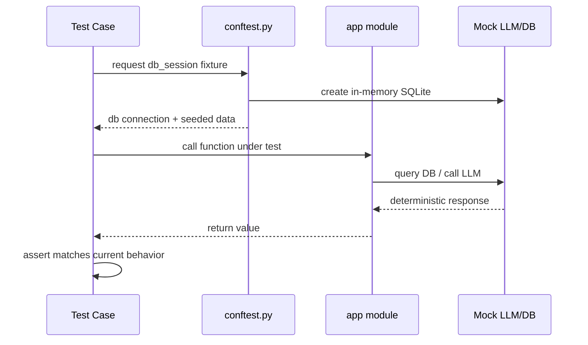
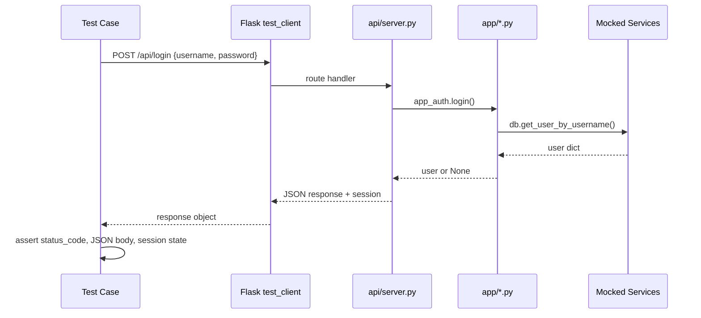

# Design Document: DVAIA Characterization Tests

## Overview

This feature introduces a comprehensive characterization test suite for the DVAIA (Damn Vulnerable AI Application) — a deliberately vulnerable Flask application used for LLM red-team training. The application currently has zero test coverage. Before any modernization, hardening, or refactoring can safely proceed, we must first document the existing behavior through characterization tests.

Characterization tests capture "what the code actually does today" rather than "what it should do." In TDD Red-Green-Refactor terms, these are the Red tests: they define the behavioral baseline that future Green implementations must preserve (or intentionally change). Since DVAIA is vulnerable by design, many tests will document insecure behavior — weak auth, SSRF, SQL injection surfaces, missing input validation — as the current expected behavior, not as bugs to fix.

The test suite is organized into 4 layers matching the application architecture: Database (app/db.py), App Logic (app/*.py), Core Services (core/*.py), and API Routes (api/server.py). All external services (Ollama LLM, Qdrant vector DB, curl_cffi HTTP) are mocked in unit tests. Integration tests requiring live infrastructure are tagged `@pytest.mark.integration` and separable from the unit suite.

## Architecture

```mermaid
graph TD
    subgraph Test Infrastructure
        CONFTEST[conftest.py<br/>Fixtures & Factories]
        MARKERS[pytest markers<br/>unit / integration]
    end

    subgraph Unit Tests - Mocked Dependencies
        T_DB[test_db.py<br/>SQLite schema, CRUD, seed data]
        T_AUTH[test_auth.py<br/>SHA256 login, session lookup]
        T_MFA[test_mfa.py<br/>Code verify, backup codes]
        T_CHAT[test_chat.py<br/>Context injection orchestration]
        T_DOCS[test_documents.py<br/>Upload, extract, delete]
        T_FETCH[test_fetch.py<br/>SSRF-vulnerable URL fetch]
        T_EMBED[test_embeddings.py<br/>Ollama embedding wrappers]
        T_RETR[test_retrieval.py<br/>RAG chunking & search]
        T_VS[test_vector_store.py<br/>Qdrant wrapper]
        T_AGENT[test_agent.py<br/>ReAct agent + 6 tools]
        T_LLM[test_llm.py<br/>LangChain factory]
        T_MODELS[test_models.py<br/>Generate function]
        T_API[test_server.py<br/>Flask route contracts]
    end

    subgraph Vulnerability Characterization
        V_AUTH[Weak auth: SHA256 unsalted]
        V_SSRF[SSRF: no URL allowlist]
        V_INJECT[Prompt injection surfaces]
        V_TEMPLATE[Template injection: no escaping]
        V_AGENT_TOOLS[Agent tools: no auth checks]
        V_DATA[Data exposure: get_internal_config]
    end

    CONFTEST --> T_DB
    CONFTEST --> T_AUTH
    CONFTEST --> T_CHAT
    CONFTEST --> T_API
    T_DB --> V_AUTH
    T_FETCH --> V_SSRF
    T_CHAT --> V_INJECT
    T_API --> V_TEMPLATE
    T_AGENT --> V_AGENT_TOOLS
    T_AGENT --> V_DATA
```

## Sequence Diagrams

### Test Execution Flow: Unit Test with Mocked LLM

### Test Execution Flow: Flask API Route Test

